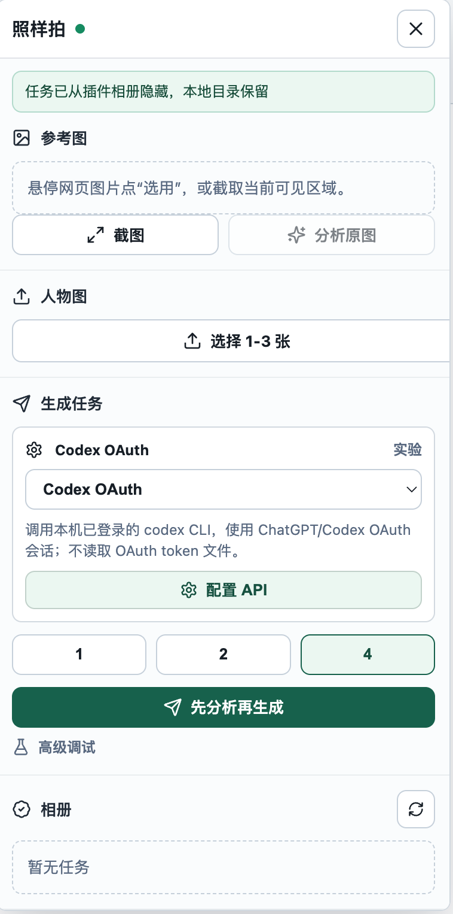

# 截图拍

截图拍是一个本地优先的 Chrome 插件工具。它可以从网页中选取参考图或截取当前可见区域，再结合用户上传的人物图，通过本地服务生成同风格图片。Chrome 中显示的插件名称为“照样拍 本地版”。



## 功能

- 网页选图或截图
- 上传人物图
- 选择本地 Provider
- 生成同风格图片
- 在本地相册查看、下载、收藏、隐藏结果

## Windows 下载使用

适合不想在 Windows 上安装源码依赖或手动构建的用户。

1. 打开 [Releases](https://github.com/Timyangyh/jietu-pai/releases)。
2. 下载 `jietu-pai-windows-x64-v0.1.4.zip`。
3. 解压整个 zip。
4. 双击 `start-local-server.cmd`，保持服务窗口打开。
5. Chrome 打开 `chrome://extensions`，开启“开发者模式”。
6. 点击“加载已解压的扩展程序”。
7. 选择解压目录里的 `app\chrome-extension` 文件夹。

Windows 包包含已构建的 Chrome 插件、本地服务单文件包和官方 Windows x64 Node.js 运行时的 `node.exe`。它不包含 `.env`、`runs/`、Provider key、OAuth token、cookie、本地上传图片、生成图片或相册历史。

运行后，本地数据会保存在解压目录的 `app\runs`。分享或重新打包时不要把 `app\runs` 发给别人。

## macOS 使用

macOS 用户使用源码安装方式，需要先安装 Node.js 和 pnpm。本地服务和 Chrome 插件仍然都在本机运行，Provider key、上传图片、生成图片和相册历史不会进入插件包或仓库。

```bash
git clone https://github.com/Timyangyh/jietu-pai.git
cd jietu-pai
pnpm install
pnpm build:extension
pnpm start:server
```

Chrome 加载插件：

```text
chrome://extensions -> 开发者模式 -> 加载已解压的扩展程序
选择：项目根目录下的 照样拍插件-本地加载版/
```

如果只下载 Chrome-only 插件包，也仍然需要在本机启动本地服务。

## 发布包

当前发布版本：`v0.1.4`

生成 Windows 用户包：

```bash
pnpm package:windows
```

输出文件：

```text
release-assets/jietu-pai-windows-x64-v0.1.4.zip
release-assets/jietu-pai-windows-x64-v0.1.4.sha256.txt
```

生成 Chrome-only 插件包：

```bash
pnpm package:extension
```

输出文件：

```text
release-assets/jietu-pai-chrome-mv3.zip
```

Chrome-only 插件包只包含扩展前端，适合已有源码环境或自己启动本地服务的用户：

1. 下载并解压 `jietu-pai-chrome-mv3.zip`。
2. Chrome 打开 `chrome://extensions`。
3. 开启开发者模式。
4. 点击“加载已解压的扩展程序”。
5. 选择解压后的 `chrome-mv3/` 文件夹。

插件包只省去构建插件这一步。完整使用仍需要本地服务：

```bash
pnpm install
pnpm start:server
```

`pnpm start:server` 会监听本地服务源码变化并自动重启服务进程。更新项目代码后不需要手动杀旧服务；如果是从旧版本升级到本机制，需要先重启一次本地服务。

发布包不会包含 `.env`、`runs/`、本地任务历史、Provider 设置、相册记录、API key、token、本地上传图片或生成图片。打包脚本会检查这些本地私人数据，发现后会停止生成 zip。

## 源码安装

```bash
git clone https://github.com/Timyangyh/jietu-pai.git
cd jietu-pai
pnpm install
pnpm build:extension
pnpm start:server
```

Chrome 加载插件：

```text
chrome://extensions -> 开发者模式 -> 加载已解压的扩展程序
选择：项目根目录下的 照样拍插件-本地加载版/
```

`pnpm build:extension` 会刷新根目录 `照样拍插件-本地加载版/`。这是 Chrome 加载用的插件前端目录。

### v0.1.4 更新

| 类型 | 更新 |
|---|---|
| Windows 包 | 新增 `jietu-pai-windows-x64-v0.1.4.zip`，下载解压后可双击 `start-local-server.cmd` 启动本地服务 |
| 本地服务 | 维护端服务脚本改为跨平台写法，避免 Windows 终端无法识别 Unix 环境变量赋值 |
| 文档 | 首页新增 Windows 用户下载使用说明，并区分 Windows 包、Chrome-only 插件包和源码安装 |

### v0.1.3 更新

| 类型 | 更新 |
|---|---|
| 测试清理 | UI 自动化验证完成后，会隐藏并删除本次新增的 Mock 测试任务目录 |
| 历史清理 | 相册标题新增一键清空历史按钮，可一次隐藏所有历史任务 |
| 服务接口 | 新增批量清理相册历史接口，避免逐张或逐任务手动删除 |

### v0.1.2 更新

| 类型 | 更新 |
|---|---|
| 生图任务 | 改为后台执行并轮询任务状态，避免页面请求中断后留下永久“生成中”任务 |
| 失败处理 | 第三方 API 超时、请求中断或服务重启后会写入失败原因，可直接重试 |
| API 超时 | OpenAI、OpenRouter、Gemini、自定义兼容 API 的识图、生图和图片下载都增加超时保护 |
| API 选择 | 识图 API 与生图 API 可分开选择，未配置 API 也可以先选择再填写配置 |
| 插件包 | 增加私人数据检查，发布包不带本地配置、任务历史和用户图片 |

## Provider 配置

| Provider | 用途 |
|---|---|
| Mock | 默认可用，不需要 key，用于确认安装和流程 |
| Codex OAuth | 本机执行 `codex login` 后使用自己的 Codex/ChatGPT 额度 |
| OpenAI API | 在本地服务侧配置自己的 `OPENAI_API_KEY` |
| Gemini Nano Banana | 在插件“配置 API”里保存 Gemini key、baseUrl 和模型后，通过第三方 API 入口生成 |
| OpenRouter | 在插件“配置 API”里保存 OpenRouter key、baseUrl 和模型后，通过第三方 API 入口生成 |
| 自定义 API | 保存兼容 `/images` JSON 图片接口的 baseUrl、key 和模型后，通过第三方 API 入口生成 |

`.env` 示例：

```bash
OPENAI_API_KEY=<your-openai-api-key>
OPENAI_IMAGE_MODEL=gpt-image-2
OPENAI_ANALYSIS_MODEL=gpt-4.1-mini
GEMINI_NANO_BANANA_API_KEY=<your-gemini-api-key>
GEMINI_NANO_BANANA_BASE_URL=https://generativelanguage.googleapis.com
GEMINI_NANO_BANANA_MODEL=gemini-2.5-flash-image
GEMINI_NANO_BANANA_ANALYSIS_MODEL=<your-gemini-vision-model>
OPENROUTER_API_KEY=<your-openrouter-api-key>
OPENROUTER_BASE_URL=https://openrouter.ai/api/v1
OPENROUTER_IMAGE_MODEL=google/gemini-2.5-flash-image-preview
OPENROUTER_ANALYSIS_MODEL=<your-openrouter-vision-model>
CUSTOM_PROVIDER_API_KEY=<your-compatible-api-key>
CUSTOM_PROVIDER_BASE_URL=https://api.example.com/v1
CUSTOM_PROVIDER_MODEL=<your-image-model>
CUSTOM_PROVIDER_ANALYSIS_MODEL=<your-vision-model>
```

API key 只应保存在本地服务侧的 `.env` 或本地设置中，不要写进插件包、截图、日志或提交记录。

配置多个第三方 API 后，识图和生图可以分别选择当前使用的 API。可以在生成任务里的“识图使用”“生图使用”下拉框切换，也可以在对应配置卡片点击“用于识图”或“用于生图”。“保存”只保存配置，不会自动切换当前使用的 API。

未配置 key 的 API 也可以先选中，插件会显示“需配置”，并保留配置入口；填写并保存 key 后即可解除需配置状态。

OpenAI 和第三方配置里的“生图模型”用于输出图片；“看图分析模型”用于读取参考图并生成图片配方。本地服务只会使用当前选择的识图 API 做原图分析，使用当前选择的生图 API 做图片生成，不会自动替你切换到备用模型。若模型因地区、额度或不支持图片输入失败，插件会显示实际错误，修改配置后可重新分析或重新生成。

## 使用

1. 启动本地服务：`pnpm start:server`。
2. 打开普通网页。
3. 打开截图拍浮层。
4. 选参考图或截图。
5. 上传人物图。
6. 选择 Provider。
7. 开始生成。
8. 在相册查看结果。

## 验证

基础检查：

```bash
pnpm typecheck
pnpm test
pnpm build:extension
pnpm smoke:server
```

需要排查插件界面时，可以额外运行：

```bash
pnpm exec playwright install chromium
pnpm verify:ui
```

## 常见问题

| 问题 | 处理 |
|---|---|
| 插件打不开 | 不要在 `chrome://` 页面、新标签页或 Chrome 设置页使用 |
| 连接失败 | 确认 `pnpm start:server` 正在运行 |
| 构建后还是旧插件 | 重新运行 `pnpm build:extension`，再到 Chrome 扩展页重新加载 |
| 删除后又出现 | 重启本地服务，重新加载插件并刷新网页 |
| Mock 图片不像真人 | Mock 只测试流程，真实生成请切换 Codex OAuth、OpenAI API、Gemini、OpenRouter 或自定义 API |

## 本地数据

这些文件只属于本机运行环境，不要提交到 Git：

```text
.env
.env.*
runs/
node_modules/
.output/
.wxt/
.tmp/
release-assets/
*.zip
```

## 安全

本项目不会把用户图片、Provider key 或相册记录上传到仓库。安全问题请查看 [SECURITY.md](SECURITY.md)。

## License

MIT
